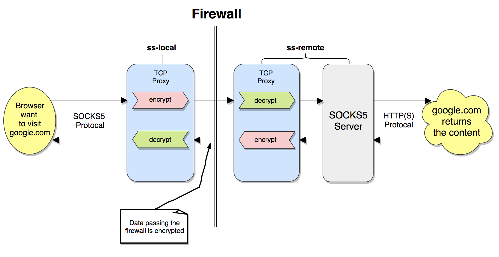

# simple-shadow

> [中文介绍](./README_CN.md)
100 行 js 代码写一个类似 shadowsocks 的科学上网工具

## Usage

```bash
# install
npm install -g viti

# start remote server
viti --remote --password 'sample password'

# start local server and connect with remote
viti --local --host '12.12.12.33' --password 'sample password'
```

#### Note
1. local server will be listening on `127.0.0.1:1081`; Then, you need to [set up socks proxy for your computer](https://github.com/timqian/my-notes/issues/149)
1. remote server will be listening on port `1082`; make sure this port is opened.
1. password of remote and local server should be the same

## How simple-shadow works
#### The principle is simple:

用于墙的存在，本地计算机无法访问 google.com。
但是本地机器可以访问一个在墙外的机器（该机器可以访问 google.com）。
很容易想到，你可以通过墙外的那台机器代替你去访问 google，然后把反馈发送给你。

#### Detailed procedure is
1. browser want to visit google.com; the request is sent in SOCKS5 protocal to `local tcp proxy`
1. `local tcp proxy` encrypt the data and send to `remote tcp proxy`(pass the wall)
1. `remote tcp proxy` decrypt the data and send to `SOCKS5 server`
1. `SOCKS5 server` do the request to google.com and send the response back to `remote tcp proxy`
1. `remote tcp proxy` encrypt the data and send to `local tcp proxy`(pass the wall)
1. `local tcp proxy` decrypt the data and send back to brower, now you can access google.com!



## Concepts to grasp
- [SOCKS5](https://en.wikipedia.org/wiki/SOCKS): 一种网络传输协议，主要用于客户端与外网服务器之间通讯的中间传递。我们使用 SOCKS5 在服务端代表浏览器请求相应网站
- [AES (Advanced Encryption Standard)](https://en.wikipedia.org/wiki/Advanced_Encryption_Standard): AES 是一种 [对称密钥加密算法](https://en.wikipedia.org/wiki/Symmetric-key_algorithm) (加密解密用的同一个密钥). 我们使用 AES 来加密解密来往于本地和远程服务器之间的数据